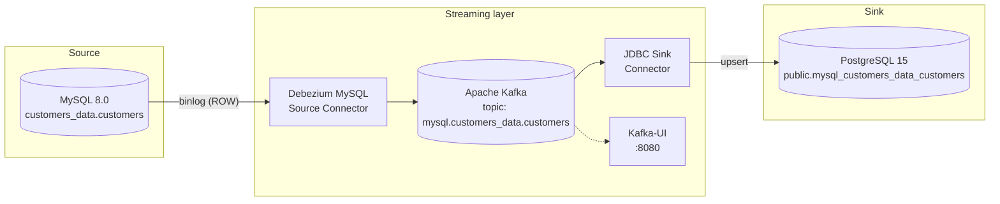

# MySQL → PostgreSQL CDC Pipeline

[](https://github.com/abhistac/mysql-to-postgres-cdc/actions/workflows/smoke.yml)
[](LICENSE)


Real-time Change Data Capture from **MySQL → Kafka → PostgreSQL** using Debezium and Kafka Connect. The full stack — MySQL, Kafka, Zookeeper, Kafka Connect, PostgreSQL, and a monitoring UI — runs locally with a single `make up`.

This is the same pattern used in production for **zero-downtime database migrations**, **event-driven data synchronisation**, and **real-time data lake ingestion**. The repo demonstrates the end-to-end mechanics — binlog → Kafka topic → upsert into target DB — with schema evolution, idempotent replays, and an automated end-to-end test.

---

## What it does

| Capability | How |
|-----------|-----|
| **Initial snapshot** | Debezium reads all existing MySQL rows on first start |
| **Continuous replication** | Every INSERT, UPDATE, DELETE streams as a Kafka event |
| **Schema evolution** | `ALTER TABLE` in MySQL → column appears in PostgreSQL automatically |
| **Upsert semantics** | Duplicate events are idempotent — no double-writes on replay |
| **Topic normalisation** | `schema.table` naming converted to PostgreSQL-safe identifiers |
| **End-to-end smoke test** | `make smoke` proves the pipeline still works after any change |

---

## Architecture



**Services:**

| Service | Image | Port |
|---------|-------|------|
| MySQL | `mysql:8.0` | 3306 |
| PostgreSQL | `postgres:15` | 5432 |
| Kafka | `confluentinc/cp-kafka:7.6.1` | 9094 |
| Zookeeper | `confluentinc/cp-zookeeper:7.6.1` | 2181 |
| Kafka Connect | custom (see [`connect/Dockerfile`](connect/Dockerfile)) | 8083 |
| Kafka-UI | `provectuslabs/kafka-ui:v0.7.2` | 8080 |

---

## Prerequisites

- Docker Desktop (or Docker Engine + Compose plugin)
- `jq` and `envsubst` (`brew install jq gettext` on Mac, `apt install jq gettext-base` on Linux)
- ~4 GB free RAM (Kafka + Connect are memory-heavy)

---

## Quick start

```bash
# 1. Copy the env template (defaults work out of the box)
cp .env.example .env

# 2. Start the stack and wait for Kafka Connect to be ready
make up

# 3. Register both connectors (idempotent — safe to re-run)
make register

# 4. Verify both show state: RUNNING
make status

# 5. Run the end-to-end smoke test
make smoke
```

The initial snapshot runs automatically — MySQL seed data is already in PostgreSQL by the time `make up` returns.

---

## Verify end-to-end

```bash
make smoke         # automated: insert + update propagate within 60s
make demo-insert   # manual: insert 3 rows in MySQL, count them in Postgres
make demo-update   # manual: update a row in MySQL, see it in Postgres
make demo-schema   # manual: ALTER TABLE in MySQL, verify Postgres column appears
```

Or open a shell and inspect directly:

```bash
make psql          # → SELECT * FROM public.mysql_customers_data_customers;
make mysql         # → SELECT * FROM customers_data.customers;
```

Or browse the Kafka topics in [Kafka-UI](http://localhost:8080).

---

## All make commands

```
make up           Start the full stack (waits for Connect to be ready)
make down         Stop all containers
make build        Rebuild the Connect image
make reset        Full teardown including Docker volumes (clean slate)

make register     Register both connectors (idempotent)
make status       Show connector state (both should be RUNNING)
make smoke        Run the end-to-end smoke test

make logs         Follow Kafka Connect logs
make psql         Open PostgreSQL shell
make mysql        Open MySQL shell

make demo-insert  Insert 3 rows and verify replication
make demo-update  Update a row and verify propagation
make demo-schema  Add a column and verify schema evolution

make help         Show all commands
```

---

## Configuration

All credentials live in `.env` (template: `.env.example`). Values are interpolated into:
- `docker-compose.yml` for container env
- `mysql/init/02-users.sh` for the Debezium replication user
- `connectors/*.json` via `envsubst` at registration time

To change a password, edit `.env` and re-run `make register` — the registration scripts are idempotent and use `PUT /connectors/<name>/config` to update existing connectors.

---

## Security & deployment notes

This repo is a **local development demo**. A few things to know before doing anything else with it:

- All container ports (3306 MySQL, 5432 Postgres, 8083 Connect, 8080 Kafka-UI, 9094 Kafka) are bound to the host for convenience. Do not deploy this `docker-compose.yml` verbatim to a public host — Kafka-UI has no authentication, and the JDBC and MySQL ports would be reachable from the network.
- `.env.example` ships with demo passwords (`rootpwd`, `dbz`, `postgres`). For anything beyond a local demo, generate fresh credentials in `.env` (which is gitignored).
- Kafka Connect stores connector configs — including the substituted passwords — in plaintext inside its `connect-configs` Kafka topic. A production setup would use `FileConfigProvider` or an external secret manager (Vault, AWS Secrets Manager) instead.

---

## Common issues

**`make register` fails with connection refused.** Connect isn't ready yet. `make up` waits automatically; if you ran `register` manually, wait 60–90 s after `docker compose up` then try again.

**Connector shows `state: FAILED`.** Most often: MySQL wasn't ready when Debezium tried to connect. Check `make logs`, then `make down && make up` to restart cleanly.

**Port 3306 or 5432 already in use.** Stop any local MySQL/Postgres instances, or change the host ports in `docker-compose.yml`.

**Smoke test times out.** Connectors may have started but not reached `RUNNING` state. Run `make status` — if either shows `FAILED`, `make logs` will explain why.

---

## Connector configuration

**[`connectors/mysql-source.json`](connectors/mysql-source.json)** — Debezium MySQL Source

- `snapshot.mode: initial` — snapshots existing data on first run, then switches to streaming
- `transforms.unwrap` — extracts the `after` field from Debezium's envelope so the sink receives flat records
- `delete.handling.mode: rewrite` — appends `__deleted: true` to deleted records instead of emitting tombstones

**[`connectors/jdbc-sink.json`](connectors/jdbc-sink.json)** — Confluent JDBC Sink

- `insert.mode: upsert` — uses `INSERT ... ON CONFLICT` so replayed events don't create duplicates
- `auto.evolve: true` — adds new columns to PostgreSQL when MySQL schema changes
- `pk.fields: customerKey` — required for upsert to work correctly
- `transforms.topicToTable` — RegexRouter rewrites `mysql.customers_data.customers` → `mysql_customers_data_customers` (PostgreSQL doesn't allow dots in table names)

---

## Version compatibility

| Component | Version | Notes |
|-----------|---------|-------|
| Confluent Platform | 7.6.1 | Kafka 3.6 |
| Debezium MySQL Connector | 2.6.1.Final | Tested against `cp-kafka-connect:7.6.1` |
| kafka-connect-jdbc | 10.7.4 | Last version with stable upsert behaviour |
| MySQL | 8.0 | `binlog_format=ROW` required |
| PostgreSQL | 15 | JDBC sink compatible |

---

## Repository layout

```
.
├── connect/Dockerfile           # Kafka Connect image with Debezium + JDBC plugins
├── connectors/
│   ├── mysql-source.json        # Debezium MySQL source config
│   └── jdbc-sink.json           # Confluent JDBC sink config
├── mysql/
│   ├── my.cnf                   # binlog config (ROW format)
│   ├── init/                    # auto-run by MySQL on first start
│   │   ├── 01-schema.sql        # creates customers table + seed rows
│   │   └── 02-users.sh          # creates Debezium replication user
│   └── sql/add_demo_rows.sql    # used by `make demo-insert`
├── scripts/
│   ├── wait-for-connect.sh      # called by `make up`
│   ├── register-mysql-source.sh # idempotent connector registration
│   ├── register-jdbc-sink.sh    # idempotent connector registration
│   ├── check-status.sh          # called by `make status`
│   └── smoke-test.sh            # called by `make smoke`
├── .github/workflows/smoke.yml  # CI: runs the smoke test on every PR
├── docker-compose.yml
├── Makefile
└── .env.example
```

---

## Author

**Abhista Atchutuni** — AI & Data Engineer
[linkedin.com/in/abhistac](https://linkedin.com/in/abhistac) · [abhistaca@gmail.com](mailto:abhistaca@gmail.com) · [abhistac.github.io](https://abhistac.github.io)
